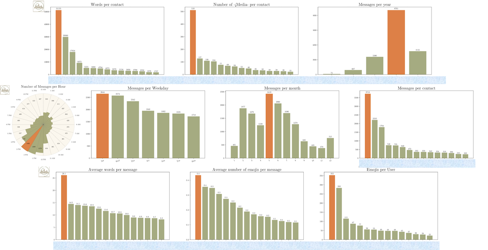

# AnalyzeTheChat
 Python based WhatsApp chat analyzer

# Demo
The online demo can be found [here](http://www.prism.gatech.edu/~manwar8/AnalyzeTheChat)


# How to Install AnalyzeTheChat?
It is advisable to make a new virtual environment (with python 3.6) for this project. Step-by-Step  
details on creating a virtual environment can be found [here](https://towardsdatascience.com/setting-up-python-platform-for-machine-learning-projects-cfd85682c54b)

## Clone the repository
Once you have created the virtual environment, activate it and use the following command.
```
git clone https://github.com/aqeelanwar/AnalyzeTheChat.git
```

## Install required packages
```
cd AnalyzeTheChat
pip install -r requirements.txt
```

# How to run AnalyzeTheChat?
## Export the WhatsApp chat
Export the WhatsApp chat you like to analyze using the following steps
1. Open the WhatsApp chat
2. Click the three vertical dots on top-right
3. Click More
4. Click Export Chat
5. Click Without Media
6. Save the generated .txt file where it is accessible


## Execute the code
```
# Generic
python main.py --path <path-to-chat> --save_as <save-type>

# Example
python main.py --path theoffice.txt --keyword 'jello' --save_as pdf
```
## Arguments

| Argument 	| Type     	|                                        Explanation                                       	|
|:--------:	|----------	|:----------------------------------------------------------------------------------------:	|
|   path   	| Required 	| Path to the .txt file exported from previous step                                        	|
|  keyword 	| Optional 	| Keyword that needs to be searched in the chat and plotted w.r.t each contact in the chat 	|
| save_as  	| Optional 	| Format of the saved graphs. [pdf, png, jpg]                                              	|


## View the results
The results can be viewed in the results folder.


# Example



##Reference
If you this repository or any part of it, please make a proper reference to
````AnalyzeTheChat: https://github.com/aqeelanwar/AnalyzeTheChat````
